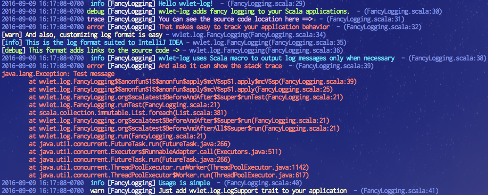

wvlet-log
===

wvlet-log is a library for adding fancy logging to your Scala application:


wvlet-log uses the standard `java.util.logging` library,
which is already available in JVM, so it works without adding any dependencies.


## Usage

[](https://maven-badges.herokuapp.com/maven-central/org.wvlet/wvlet-log_2.11/)

```scala
libraryDependencies += "org.wvlet" %% "wvlet-log" % "(version)"
```

### LogSupport trait

The most convenient way to use wvlet-log is adding `LogSupport` to your class:

```scala
import wvlet.log.LogSupport

object MyApp extends LogSupport  {
   info("info log")
   debug("debug log")
}
```

The logger name will be determined from your class name (e.g., `MyApp`).

Alternatively you can load `Logger` instance manually:

```scala
import wvlet.log.Logger

class YourApp {
   private val logger = Logger.of[YourApp]
}
```

## Configuring log levels

If `Logger.scheduleLogLevelScan` is called, wvlet-log periodically scans log-level properties file (default every 1 minute) to configure logger levels:

```scala
improt wvlet.log.Logger

## Scan log files 
Logger.scheduleLogLevelScan
```

***log.properties*** example:
```
# You can use all, trace, debug, info, warn, error, info, all as log level
wvlet.airframe=debug
org.eclipse.jetty=info
org.apache.http=info
com.amazonaws=info
```
The format follows [Java Properties file format](https://docs.oracle.com/javase/7/docs/api/java/util/Properties.html#load(java.io.Reader)).


In default, loglevel file will be found in this order:  

 1. `log-test.properties` in the classpath. 
 1. If 1. is not found, use `log.properties` in the classpath.

To configure log file path, you can use `Logger.scheduleLogLevelScan(file paths, duration)`.

In debugging your application, create `src/test/resources/log-test.properties` file, and
call `Logger.scheduleLogLevelScan` before running test cases. This is useful for quickly checking the log messages. 

## Customizing log format

You can show the source code location where the log message is generated:

```scala
import wvlet.log._

object MyApp with LogSupport {
   Logger.setDefaultFormatter(LogFormatter.SourceCodeLogFormatter)

   info("log with source code")
}

```
This code will show:
```
[MyApp$] log with source code - (MyApp.scala:6)
```

You can also define your own LogFormatter:

```scala
import wvlet.log.LogFormatter._
object CustomLogFormatter extends LogFormatter {
  override def formatLog(r: LogRecord): String = {
    val log = s"[${highlightLog(r.level, r.leafLoggerName)}] ${highlightLog(r.level, r.getMessage)}"
    appendStackTrace(log, r)
  }
}

Logger.setDefaultFormatter(CustomLogFormatter)
```

See also other examples in [LogFormat.scala](src/main/scala/wvlet/log/LogFormat.scala).


## Internals

### Scala macro based logging code generation

wvlet-log is efficient since it generate the log message object only when necessary. For example, this logging code:
```scala
debug(s"heavy debug log generation ${obj.toString}")
```
will be translated into the following efficient one by using Scala macros:
```scala
if(logger.isDebugEnabled) {
   debug(s"heavy debug log generation ${obj.toString}")
}
```
Log message String generation will not occure unless debug log is effective. Scala macro is also used for finding source code location (LogSource).


## Why wvlet-log uses `java.util.logging` instead of `slf4j`?

`slf4j` is just an API for logging messages, so you cannot configure log level and its messasge format *within your program*.
 And also, slf4j's logging configruation needs to be binder-specific (e.g., slf4j-simple, logback-core, etc.), and your application always need to include
  a dependency to slf4j implementation. `java.util.logging` is a standard API and no binding library is required.

You can also redirect wvlet-log message to log4j, slf4j, etc.

